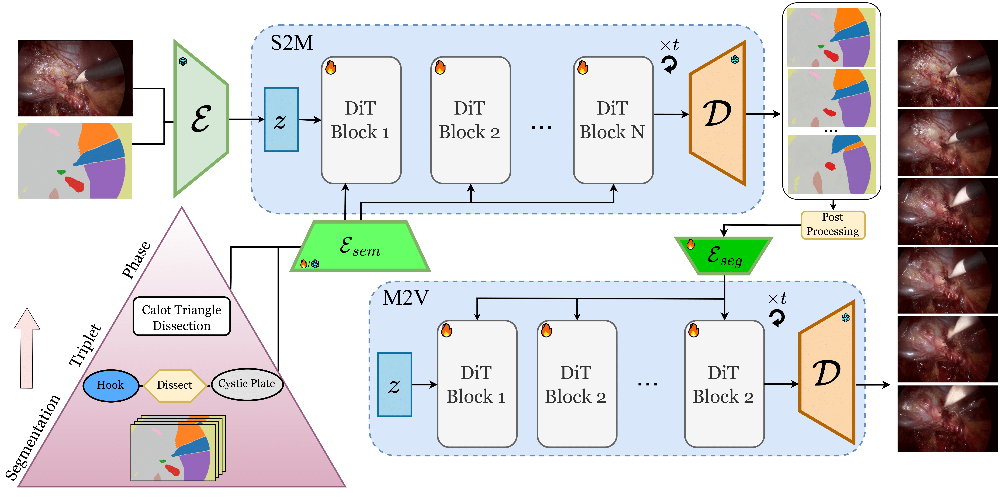

# HieraSurg: Hierarchy-Aware Diffusion Model for Surgical Video Generation
[](https://arxiv.org/abs/2506.21287) [](https://diegobiagini.github.io/HieraSurg/)    

Early Accepted at MICCAI 2025

HieraSurg is a pair of video diffusion model based on CogVideoX, enabling the realistic generation of surgical videos.
Video generation is achieved by decoupling the generation process in two semantic levels, first Hierasurg-Semantic2Map generates the evolution of a surgical scene in panoptic-segmentation-space, given surgical information like phase and interaction triplet.
Once a temporal set of segmentation maps is available HieraSurg-Map2Vid is able to bring them to video space to visualize the actual evolution of the surgical scene.

This repository contains the code used to train the VDMs as well as the procedure to obtain panoptic segmentation maps from Cholec80.



## Table of Contents
- [Features](#features)  
- [Installation](#installation)  
- [Usage](#usage)  
- [Dataset](#dataset)  
- [File Structure](#file-structure)  
- [Citation](#citation)  
- [License](#license)  

## Features

- Labeling procedure for CholecT50/Cholec80
- Inference with/without GT segmentation maps TODO (upload weights)
- Training code for HieraSurg (S2M and M2V) TODO

## Installation TODO

1. Clone the repository  
   ```bash
   git clone https://github.com/USERNAME/REPOSITORY_NAME.git
   cd REPOSITORY_NAME
   ```
2. Create a virtual environment (optional but recommended)  
   ```bash
   python3 -m venv venv
   source venv/bin/activate
   ```
3. Install required packages  
   ```bash
   pip install -r requirements.txt
   ```  

## Usage TODO

### Training

```bash
python scripts/train.py \
  --config configs/train.yaml \
  --data_dir /path/to/data \
  --output_dir /path/to/output
```


### Inference

```bash
python scripts/infer.py \
  --model /path/to/best_model.pth \
  --input sample_input.txt \
  --output sample_output.txt
```

## Dataset

All the data used is from [Cholec80](https://github.com/CAMMA-public/TF-Cholec80) and [CholecT50](https://github.com/CAMMA-public/cholect50).
Refer to the given repositories and the [CAMMA Website](https://camma.unistra.fr/datasets/) to download and prepare each of them.

The labeling pipeline expects the following folder structure:
```text
videos/
├── video01/              
│   ├── 000000.jpg
│   └── 000001.jpg
│   └── ...
├── video02/              
│   ├── 000000.jpg
│   └── 000001.jpg
│   └── ...
└── ...
```

To extract individual frames at a certain frame rate use the script:  
```python tools/cholec_video_extract_parallel.py videos_in videos 1 --with_fix```

And in case you have PNG files(CholecT45 dataset) use `labeler/to_jpg_folder.py`


### Automatic Labeling Pipeline
We suggest using a different environment to avoid possible conflicts.
1. Create the environment and install torch
   ```bash
    conda create --name sam2_autolabel python=3.10
    conda activate sam2_autolabel
    
    pip install torch==2.5.1 torchvision==0.20.1 torchaudio==2.5.1 --index-url https://download.pytorch.org/whl/cu124

   ``` 
2. Install third party libraries(SAM2 and RADIO) and additional requirements
    ```bash
    mkdir modules && cd modules
    git clone https://github.com/facebookresearch/sam2.git && cd sam2
    pip install -e .

    cd ..

    git clone https://github.com/NVlabs/RADIO
    cd ..

    pip install -r requirements_labeler.txt    
    ```
3. Download SAM checkpoints
    ```bash
    cd modules/sam2/checkpoints
    ./download_ckpts.sh
    ```
4. Run the automatic labeling inference pipeline on a folder of videos
    ```bash
    export PYTHONPATH=modules/RADIO:$PYTHONPATH
    python labeler/dataset_track.py --sam_weights_folder modules/sam2/checkpoints --dataset_folder videos --visualize
    ```
After running the script the folder structure will be the following:
```text
videos/
├── video01/              
│   ├── 000000.jpg
│   └── 000001.jpg
│   └── ...
├── video01_masks/              
│   ├── 000000.pkl
│   └── 000001.pkl
│   └── ...
├── video02/              
│   ├── 000000.jpg
│   └── 000001.jpg
│   └── ...
├── video02_masks/              
│   ├── 000000.pkl
│   └── 000001.pkl
│   └── ...
└── ...
```
Not all videos of Cholec80 were processed and used, data splits can be found in `train_videos.txt` and `val_videos.txt`.  

## File Structure

```text
REPOSITORY_NAME/
├── configs/              # YAML configuration files
├── data/                 # Dataset download scripts or samples
├── docs/                 # Paper PDF and supplementary materials
├── notebooks/            # Jupyter notebooks for analysis
├── scripts/              # Training, evaluation, inference scripts
├── src/                  # Source code modules
│   ├── __init__.py
│   └── main.py
├── tests/                # Unit and integration tests
├── LICENSE
├── README.md
├── requirements.txt
└── setup.py
```

## Citation
If you find this work useful, please cite our paper:
```bibtex
@misc{biagini2025hierasurghierarchyawarediffusionmodel,
      title={HieraSurg: Hierarchy-Aware Diffusion Model for Surgical Video Generation}, 
      author={Diego Biagini and Nassir Navab and Azade Farshad},
      year={2025},
      eprint={2506.21287},
      archivePrefix={arXiv},
      primaryClass={cs.CV},
      url={https://arxiv.org/abs/2506.21287}, 
}
```
## License

This code may be used for **non-commercial scientific research purposes** as defined by [Creative Commons 4.0](https://creativecommons.org/licenses/by-nc-sa/4.0/legalcode). By downloading and using this code you agree to the terms in the [LICENSE](LICENSE). 